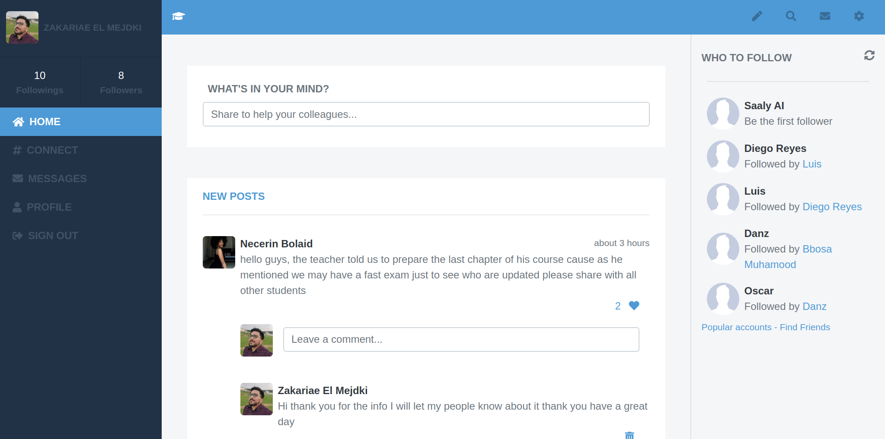
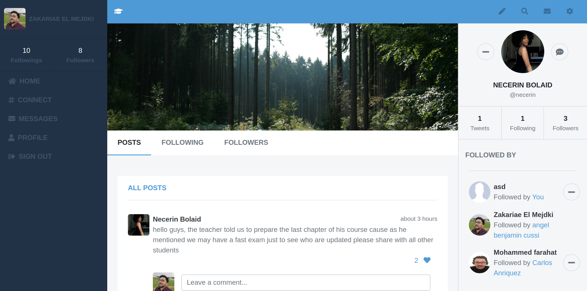
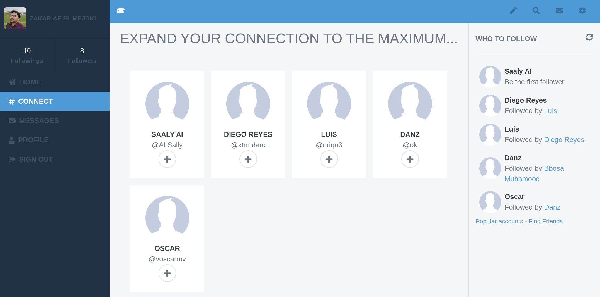
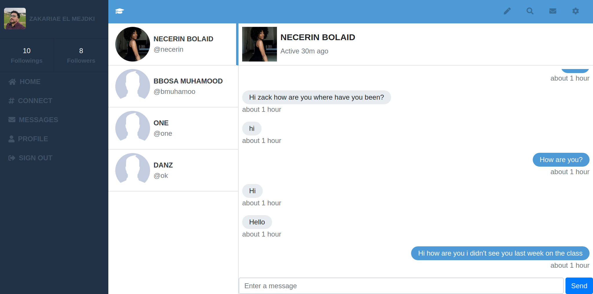

# Academia

**This is a capstone project required by [Microverse](https://www.microverse.org/), after finishing a big section of a technical curriculum related to Rails, they have choose this project for me to prove my technical knowledge, you can find the requirement [here](https://www.notion.so/Twitter-redesign-f8a8d48453d54d1a949bb0ceab4c8718)**

> Academia is the most efficient application that you can add to your school to keep your students updated with you school's news, and prevent them from wasting time on social media platforms, instead of that they can use Academia to contact each other and share the latest news about there class and school, in order to use the platform you will need a proper sign up with an email, avatar and cover picture. when you log in you will get redirected to the home page where you can see your own and your following posts at any moment you can click on a user profile image or name to get redirected to his profile if you want to start a conversation with him you will need to click on the message icon next to his profile image.

## Project Presentation Video
[](https://www.loom.com/share/d731c98d7a0a4fe198fb9a7a7275ee77)


## Features

- A user can sign up and log in using his email and password.
- A user can share his own posts on the home page or profile page
- A user can remove and edit his own posts
- A user can comment on posts
- A user can remove his own comments
- A user can like and dislike a post
- A user can visit his own profile page and other users profile page
- A user can see who is following other users, and who is he following also.
- A user can follow other users, and also he can be followed by them
- A user can contact other users directly using the messages feature
- A user can edit his own information


## Built With

- Ruby v2.6.5;
- Rails v6.0.3.2;
- Simple Form v5.0.2;
- Redis v4.2.1;
- Devise v4.7.2;
- AWS S3 v1.71.1;
- Bootstrap v4.5.0;
- PostgreSQL 1.2.3


## Live Demo

[](https://academiaz.herokuapp.com/)


## Home page




## Profile page




## Connect page




## Messages page




### Prerequisites

Ruby v2.6.5, Rails v6.0.3.2, Postgres: >=9.5

### Setup

install gems with

```
bundle install
```

Setup database with:

```
rails db:create
rails db:migrate
```


## IMPORTANT

**I used S3 AWS service in order to store images. Therefore, I used SECRET KEYS stored in environment variables on my development and production servers.**

- So if you have AWS credentials create a file an application.yml file inside config/ and put this your credentials in it like showing bellow:

```ruby
  development:
    access_key_id: your_access_key_id_goes_here
    secret_access_key: your_secrect_access_key_goes_here
```

### Run Tests

To run tests you can easily go to the root of the project and then run the following command:

```
rspec
```

You can also add your own test cases on the `/spec` directory.

### Usage

Start server with:

```
rails s
```

Then open `http://localhost:3000/` in your browser

# Future Features

- Allow users to search for each other using a search field in the top navbar
- Make the website mobile friendly
- Allow the users to share videos and Photos on there feeds
- Make all of the top navbar links working.

## Author

👤 **Zakariae El Mejdki**

- GitHub: [@elmejdki](https://github.com/elmejdki)
- Twitter: [@zakariaemejdki](https://twitter.com/zakariaemejdki)
- Linkedin: [Zakariae El Mejdki](https://www.linkedin.com/in/zakariaeelmejdki/)

## Credits

Thanks to [Gregoire Vella](https://www.behance.net/gregoirevella) for his awesome [design work ](https://www.behance.net/gallery/14286087/Twitter-Redesign-of-UI-details) that I based my work on.

## 🤝 Contributing

Contributions, issues and feature requests are welcome!

Feel free to check the [issues page](issues/).

## Show your support

Give a ⭐️ if you like this project!

## 📝 License

This project is [MIT](lic.url) licensed.
